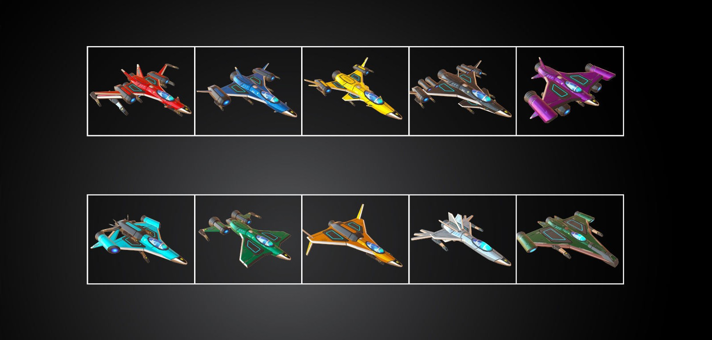

# CryptoStarships NFT

&#x20;                                 

.png>)

**CryptoStarships** use standard **BEP-721** to create NFT Token. That can help players easy to manage their NFT across **Binance Smart Chain ecosystem**.

There are common, uncommon, rare, epic, and legendary rarities, with Legendary being the highest. The differences between these rarities include:

* **Win Rate** - This is what you can't see, but it will greatly affect your **ROI** (luck does affect, too, as these are statistics). Your chance of being the first / second / third / fourth / fifth with each rarity class varies depending on the set of attributes obtained.
* Damage taken in Starships depends on ranking position.
* **1º** 0% **Damage/** **2º** 2% **Damage/**  **3º** 4% **Damage/**  **4º** 6% **Damage/** **5º** 8% **Damage.**
* **KERO Capacity**: Common / Uncommon **100**, Rare ships have **125 KERO** capacity, Epic ships have **150 KERO** capacity and Legendary ships have **175 KERO** capacity.
* **Statistics**: Power affects your contribution in **WORLD BOSS**, speed, attack and LVL affect your ability in **PvP** (hint: **PvP** will be similar to training, but you will do it against ships of other captains and guess what, in real time and with higher rewards).
* **Daily Withdrawal Limit**: Once the **Starships** fusion feature is updated, your daily withdrawal limit will be calculated based on your number of ships and their rarity. Having more ships of higher rarity gives you a higher limit, but you cannot exceed  **500 $CSSR** every **24** hours.

**SHIPS INDEX**

**RARITIES                ENERGY          VELOCITY              ATTACK                KERO           DAÑO/RECIBIDO**

**COMMON              120-150           130-170                  50-55                    100**

**UNCOMMON        130-160           140-180                 52-57                     100**

**RARE                       140-170            150-190                 54-59                     125**

**ÉPIC                         150-180            160-200                56-61                      150**

**LEGENDARY         160-190            170-210                 60-65                     175**
